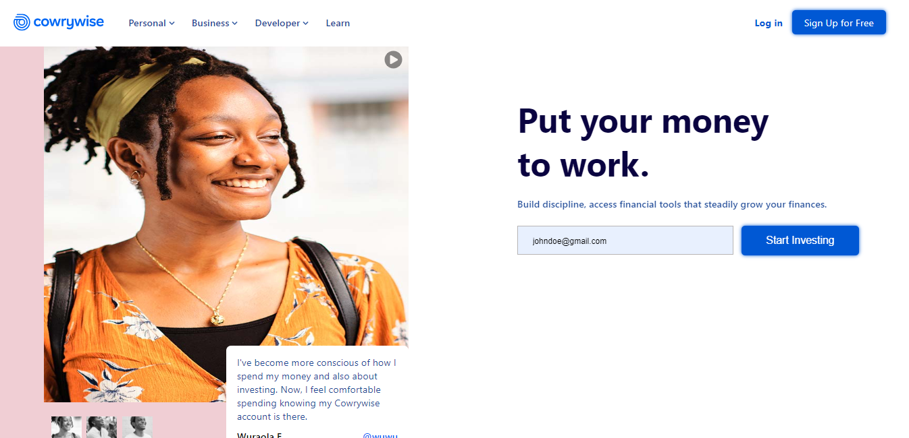
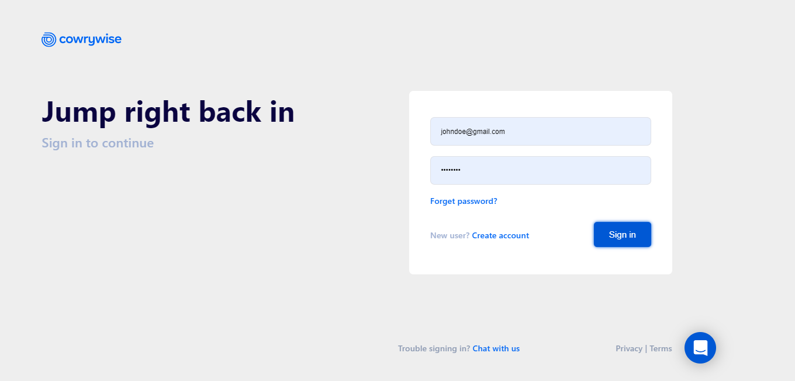
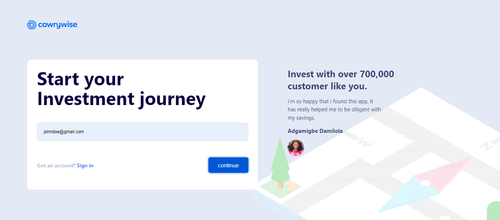

# Cowrywise Landing Page
<div align=center>

</div>

- [Overview](#overview)
- [Tech Stack](#tech-stack)
- [Features](#features)
- [Installation](#installation)
- [Pages](#pages)
   - [Home page](#home-page)
   - [Login page](#login-page)
   - [Sign up page](#signup-page)
- [Design](#design)
- [What i Learned](#what-i-learned)
- [Continued Development](#continued-development)
- [Contributors](#contributors)

## Overview 
 This project is part of my attempt to recreate the site's of popular brands around my region. 
 I had a lot of fun building this project, as i got the chance to practice building tricky layouts.

## Tech Stack
Nothing to fancy was used to build the project but you can take a look at my tech stack.

- [React](https://#) (Frontend Library)
- [Framer Motion](https://#) (Animation Library)
- [Vite](https://#) (Module Bundler)
- [React router dom](https://#) (For client side Routing)
- [Javascript](https://#) (For all the bugs in my program.)


## Features
- A Custom carousel
- Mobile navigation

## Installation
Installing the project can be done in 4 easy steps.
1. Clone the git repository to your locally machine
```git
    $ git clone https://www.github.com/nathan_somto/cowrywise-landing-page.git
```
2. Run the command to install all dependencies
```git
    $ npm installl
```
3. Start the server
```git
    $ npm start
```
4. Open it on your favourite browser (Most likely chrome.)
```git
   $ server started on http://localhost:5173
```
## Pages

### Home page



### Login page


### Signup page


## Design
The link to the figma file, i used 
## What i Learned

## Continued Development

## Contributors
- [Nathan_Somto](https://www.github.com/Nathan_Somto)
